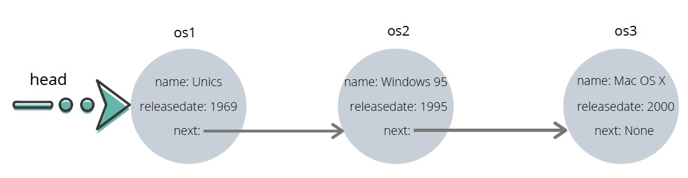
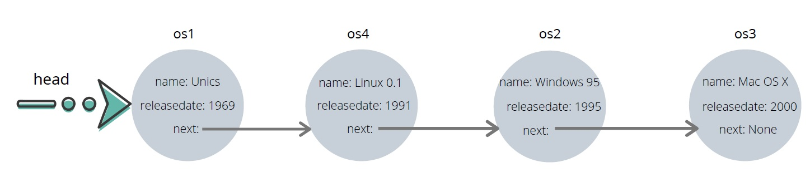

# 3. Programmieraufgabe: Einfach verkettete Liste

## Abgabe bis Mittwoch, 25. Mai 2022, 23:59 Uhr

### Allgemeine Hinweise

Bitte lesen Sie die folgenden Hinweise genau durch!

* Sie haben max. drei Versuche, eine korrekte Lösung einzureichen.
* Bitte verwenden Sie die `solution.py` als Basis. Beachten Sie dabei:
    - Behalten Sie die Schnittstellen der zu implementierenden Funktionen genau bei.
    - Fügen Sie keinen unnötigen Code außerhalb der Funktionen oder Klassen ein. Definieren Sie insbesondere keine globalen Variablen.
    - Verwenden Sie keine `input`- oder `import`-Anweisungen.
* Testen Sie Ihren Code selbst mit den von uns zur Verfügung gestellten Tests, bevor Sie ihn einreichen! Sie können auch weitere Testfälle hinzufügen, die Sie sich selbst ausdenken! Wir testen Ihren Code ebenfalls noch mit zusätzlichen Eingaben.
* Die Abgabe erfolgt individuell. Kopieren von Code von anderen Studierenden ist verboten und wird als Betrugsversuch interpretiert.
* Verwenden Sie Python 3 (nicht 2).

**Für diese Aufgabe wird ingesamt 1 Punkt vergeben.**

### Aufgabenstellung

In dieser Aufgabe tauchen Sie in die Welt der Betriebssysteme ein.
Die ersten Betriebssysteme sind in den 1950er erschienen. Im Jahr 1969 wurde Unics veröffentlicht, das das bekannte Warenzeichen Unix geprägt hat. Dieses Betriebssystem hat die berühmten Nachfolger inspiriert, wie z.B. Linux und Mac OS. In dieser Aufgabe sollen Sie die Chronologie der Betriebssysteme mit Hilfe von einfach verketten Listen in der objektorientierten Implementierung darstellen.

Die Datei `solution.py` stellt bereits zwei Klassen zur Verfügung: `OperatingSystem` und `OSTimeline`.

Die Klasse `OperatingSystem` hat drei Datenelemente: Name, Erscheinungsjahr und Nachfolger (dieser wird standardmäßig auf `None` gesetzt).

Die Klasse `OSTimeline` hat nur ein Datenelement (`head`) und die zwei Methoden `traverse()` und `insert(name, releaseDate)`.
Eine `OSTimeline` ist eine chronologisch sortierte Sequenz von Betriebssystemen, die als eine einfach verkettete Liste repräsentiert wird.

Die Methode `traverse` durchläuft (traversiert) die Timeline in chronologischer Reihenfolge und gibt die Elemente als Liste zurück.

Die Methode `insert` fügt ein neues Betriebssystem in die Timeline ein und behält dabei die Sortierung bei. Wenn beispielsweise ein Betriebssystem mit den Parametern `name="Linux 0.1"` und `releaseDate=1991` in die folgende Timeline eingefügt wird:

...dann muss es nach „Unics“ und vor „Windows 95“ einsortiert werden:

Beim Einfügen können also drei Fälle auftreten:

1. Ein Betriebssystem wird als `head`-Element eingefügt.
2. Ein Betriebssystem wird zwischen zwei vorhandenen Elementen eingefügt.
3. Ein Betriebssystem wird am Ende hinzugefügt.

Die Implementierung der Methode `insert` ist momentan nicht vollständig, da sie nur den ersten Fall implementiert. **Implementieren Sie die übrigen zwei Fälle, sodass ein Betriebssystem immer richtig eingefügt werden kann!**

Falls ein Betriebssystem mit dem übergebenen Erscheinungsjahr in der Timeline schon vorhanden ist, soll nichts in die Liste eingefügt werden. Die Methode soll dann `False` zurückgeben. Ansonsten soll die Methode `True` zurückgeben.

### Beispiele

(basierend auf Beispiel-Timeline, s.o.)

| Mustereingabe | Erwarteter Rückgabewert der Methode `insert` | Erwarteter Zustand der Timeline |
| --- | --- | --- |
| `"Linux 0.1", 1990` | `True` | s.o. |
| `"Red Hat Linux 6.2E", 2000` | `False` | unverändert |

